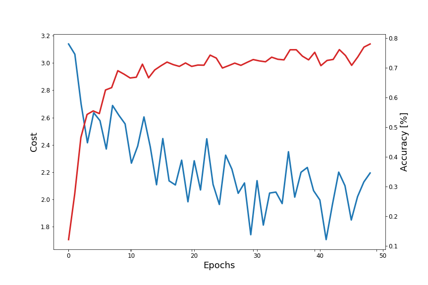
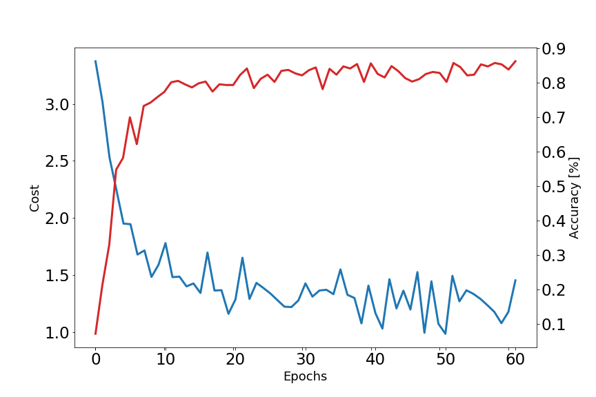
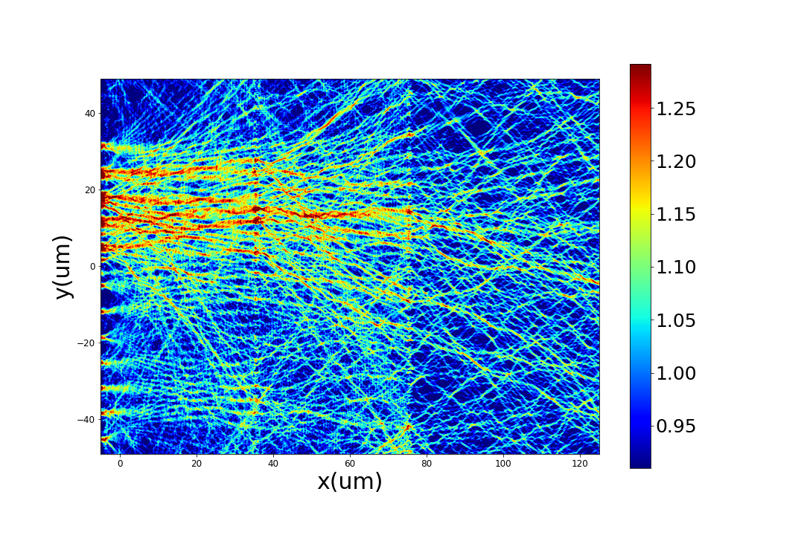
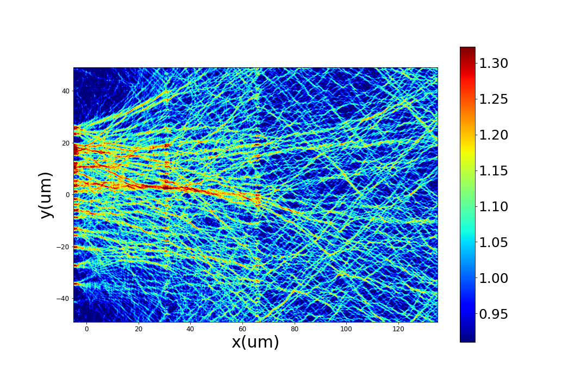
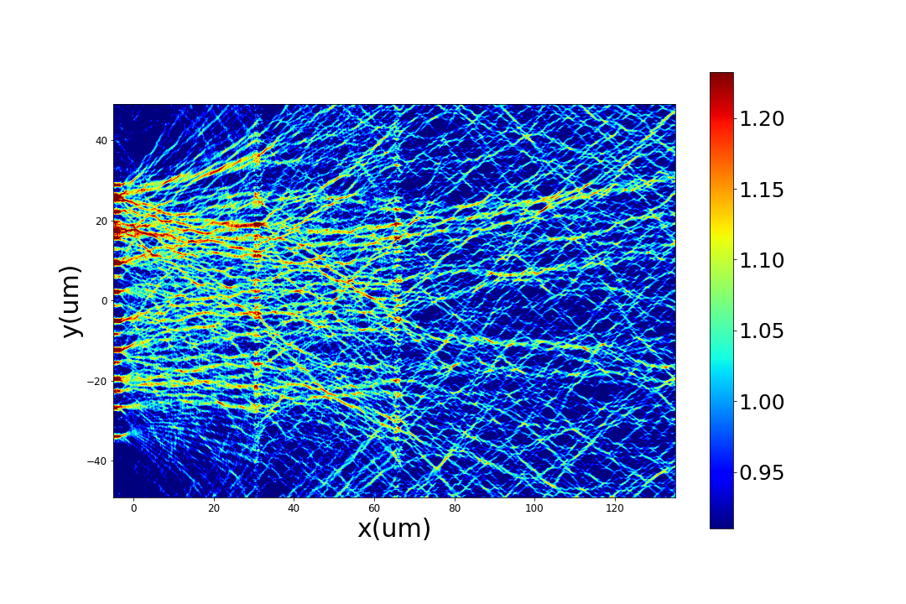
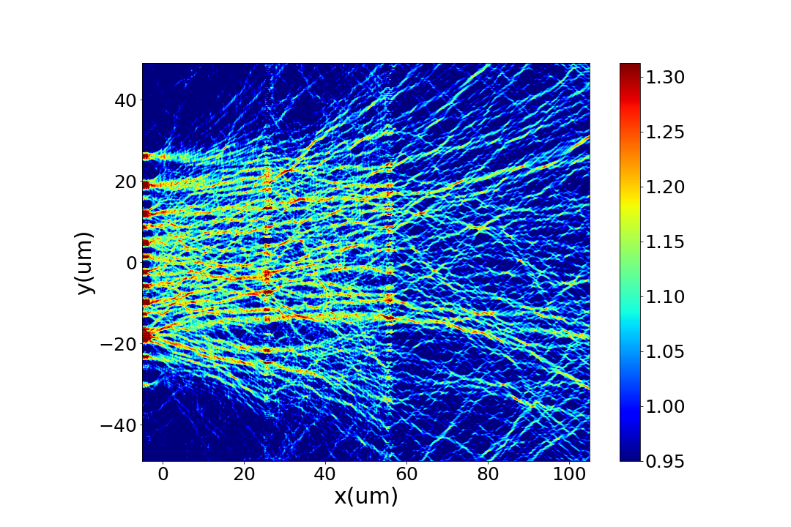
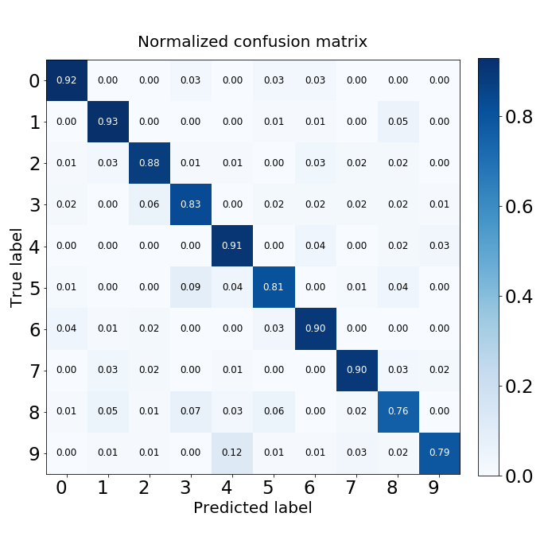

# MyONN — Integrated Photonic Neural Network based on Silicon Metalines

A whole-passive, fully-optical neural network implemented on a silicon-on-insulator (SOI)
chip using cascaded 1-D metasurfaces (*metalines*). The network performs matrix-vector
multiplications through free-space wave propagation and diffraction — entirely at the speed
of light, with near-zero power consumption during inference.

---


## Overview

The ONN consists of multiple **silicon metaline layers** — 1-D arrays of etched
rectangular slots in an SOI substrate. Each slot acts as a meta-atom that imposes
a programmable phase shift on the guided TE wave (0 – 2π, transmission > 0.96 at
λ = 1.55 µm). Cascading several metalines separated by free-space propagation
gaps implements the full matrix-vector multiplication required for deep neural
network inference.

Key highlights from the paper:

| Property | Value |
|---|---|
| Operating wavelength | 1.55 µm |
| Number of layers (full ONN) | 5 |
| Meta-atoms per layer | 784 |
| Total design parameters | 3920 |
| MNIST test accuracy | **88.8 %** |
| Inference latency | ~7.78 ps |
| Footprint | 400 × 800 µm² |
| Computational speed | 1.2 × 10¹⁶ MAC/s per layer |

---

## How It Works

### Architecture

Input images are encoded as the amplitude of guided optical pulses. The pulses
propagate through successive metaline layers, each imposing a learned phase profile.
Diffraction between layers mixes the field, performing the weighted summation of a
neural network layer. Ten photo-detectors at the output plane read the intensity in
ten designated regions — the digit with the highest intensity wins.

$$E^{\text{out}} = \left(\prod_{m=1}^{M} F^+ P^m F \Phi^{w^m}\right) E^{\text{in}}$$

where *F / F⁺* are the (I)DFT, *P^m* the free-space propagation kernel, and
*Φ^{w^m} = exp(j φ^{w^m})* the phase-modulation matrix of the *m*-th metaline.

### Training

Phase profiles are optimised offline using the **adjoint method** paired with the
**ADAM optimiser**. A cost function *C* measures the squared error between the
desired and realised output intensity distributions (Eq. 2 of the paper):

$$C = \sum_{k=1}^{K} \sum_{s=1}^{N^2} \bigl(I_s^k - I_s^{\text{des},k}\bigr)^2$$

Gradients with respect to the phase of each metaline are obtained via the chain rule
(Eq. 3):

$$\frac{dC}{dw^m} = \frac{d\,\vec{\phi}^{\,w^m}}{dw^m} \otimes \frac{dC}{d\,\vec{\phi}^{\,w^m}}$$

The key gradient term (Eq. 5) is evaluated by back-propagating an **adjoint field**
*a* = *E*<sup>out,k</sup> ⊗ (*I*<sup>k</sup> − *I*<sup>des,k</sup>) through the system:

$$\frac{dC}{d\vec{\phi}^{\,w^m}} = -4\,\mathrm{Re}\!\left[\, i \bigl(E^{m-1,k\,*}\bigr)^{\!T} \otimes \left(\prod_{m'=0}^{M-m} \Phi^{w^{M-m'}\,*} F^{+} P^{M-m'+} F\right) a \,\right]$$

This reduces each iteration to **one forward pass + one adjoint backward pass**,
making training of large networks tractable. Once training is finished the network is
**entirely passive** — inference requires no power beyond the optical input.

---

## Demo

### Training convergence

The cost decreases and test accuracy rises steadily over 50 epochs, reaching **~78 % on
the reduced 3-layer structure** (verified with Lumerical 2.5D FDTD) and **88.8 % on the
full 5-layer design**.


*Training cost (blue, left axis) and test accuracy (red, right axis) vs. epoch.*

---

### Optimised phase profiles

After training, each metaline layer holds a unique 14 × 14 phase pattern (0 – 2π).
These phase maps directly specify the slot lengths that need to be fabricated.


*Detailed view of cost/accuracy convergence during the early training stage.*

---

### Electric-field distribution — design verification

The figures below show the x–y electric-field intensity distribution inside the
fabricated-geometry ONN for representative MNIST test digits (corresponding to
Figs. 10 & 12 of the paper). For each input, the guided field is progressively
focused towards the correct output detector position by the cascaded metaline layers.

**Digit 4 — propagating through the 3-layer ONN:**



*x–y |E|-field distribution of the 3-layer ONN for input digit "4". The maximum
intensity at the output plane (right edge) falls on detector 4, giving a correct
prediction.*

---

**Digit 5 and digit 2:**

| Digit **5** | Digit **2** |
|:-----------:|:-----------:|
|  |  |

*Left: digit "5" — the field converges to detector 5 at the output. Right: digit "2" — field converges to detector 2.*

---

**Digit 6:**



*Digit "6" — field steered to detector 6 at the output plane.*

The 3-layer analytical model and the full electromagnetic simulation agree in **91 out of 100** tested cases, confirming the accuracy of the free-space propagation model used during training.

---

### Confusion matrix

The normalised confusion matrix over 1000 MNIST test images confirms that the
most common confusion pairs are "4 ↔ 9" and "5 ↔ 3" — consistent with their
visual similarity and the findings reported in the paper (Fig. 6c).


*Normalised confusion matrix of the trained ONN on the MNIST test set.*

---

## Installation

```bash
git clone https://github.com/mr-marzban/MyONN.git
cd MyONN

python -m venv venv
source venv/bin/activate   # Windows: venv\Scripts\activate

pip install -r requirements.txt
```

> The analytical electromagnetic model and all training code run with standard
> Python packages only (NumPy, TensorFlow/Keras, scikit-learn, OpenCV).

---

## Quick Start

```python
from src.physics import propagation_kernel, META_ATOM_PITCH
from src.data_utils import load_mnist_data, build_gaussian_targets, DIM
from src.training import train_onn
from keras.utils import np_utils

# Load data
data = load_mnist_data(train_sample=10000, test_sample=2000, seed=42)

# Propagation kernels
N = DIM * DIM
p        = propagation_kernel(N, META_ATOM_PITCH, 40e-6)   # inter-layer
p_out    = propagation_kernel(N, META_ATOM_PITCH, 50e-6)   # output plane

# Train
results = train_onn(
    train_images_reduced = data["train_images_reduced"],
    Y_train_extended     = build_gaussian_targets(data["train_labels"]),
    Y_train              = np_utils.to_categorical(data["train_labels"], 10),
    train_labels         = data["train_labels"],
    test_image_reduced   = data["test_image_reduced"],
    test_labels          = data["test_labels"],
    p_shifted            = p,
    p_shifted_output     = p_out,
    epoch_max            = 50,
)
print(f"Test accuracy: {results['test_acc_history'][-1]:.1f}%")
```

Or run the full example script:

```bash
python examples/train_onn.py
```

---

## Running Tests

```bash
pytest tests/ -v
```

---

## Advantages Over Related Work

| Feature | This ONN | MZI-based [4–7] | D²NN [3] |
|---|---|---|---|
| Operation | Fully passive | Active (tunable) | Passive |
| Neurons | 3920 | < 1000 | ~200 000 |
| MNIST accuracy | 88.8 % | 85.8 % | 91.75 % |
| Footprint | 0.32 mm² | > 10 mm² | cm-scale |
| Latency | 7.78 ps | ~ns | ~ns |
| Alignment | On-chip (lithography) | On-chip | Manual (free-space) |

---
## Paper

> **Mahmood-Reza Marzban**, Sanaz Zarei, and Amin Khavasi,
> *"Integrated photonic neural network based on silicon metalines,"*
> **Optics Express 28(24), 36668 (2020).**
> https://doi.org/10.1364/OE.404386

```bibtex
@article{Marzban2020ONN,
  author    = {Marzban, Mahmood-Reza and Zarei, Sanaz and Khavasi, Amin},
  title     = {Integrated photonic neural network based on silicon metalines},
  journal   = {Optics Express},
  volume    = {28},
  number    = {24},
  pages     = {36668},
  year      = {2020},
  doi       = {10.1364/OE.404386},
  url       = {https://opg.optica.org/oe/fulltext.cfm?uri=oe-28-24-36668}
}
```

---

## Contact

- **Author**: Mahmood-Reza Marzban
- **Affiliation**: Department of Electrical Engineering, Sharif University of Technology
- **GitHub**: [@mmarzban3](https://github.com/mmarzban3)

---

